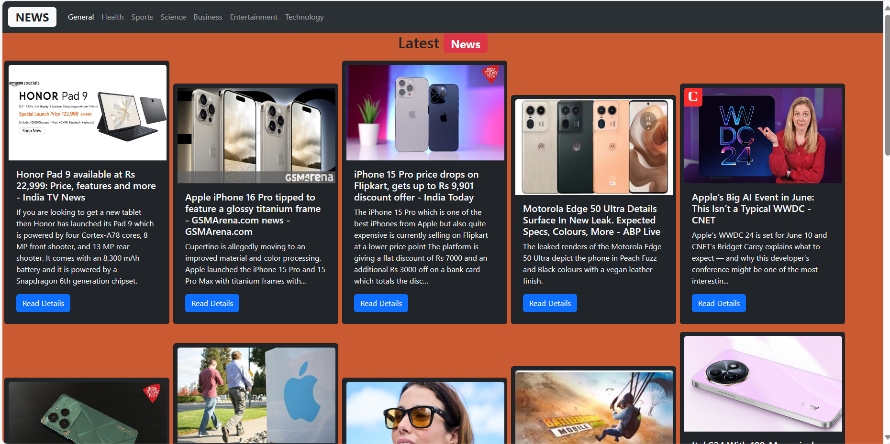
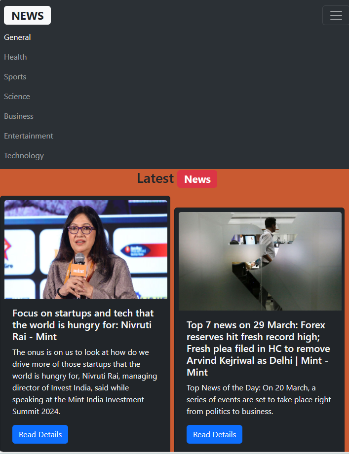

# News App
The News App is a web application that allows users to browse and read news articles from various categories. Users can select a category of interest, view a list of news articles within that category, and read the full article by clicking on a "Read Details" button.

## Features

- **Category Selection**: Users can choose from a list of news categories, such as General, Health, sports,Science, Business, Entertainment, Technology, etc.
- **News Listing**: Display a list of news articles for the selected category.
- **Short News Cards**: Each news article is displayed in a compact card format, showing the headline and a short summary.
- **Read Details**: Users can click on a "Read More" button on each news card to view the full article.
- **Responsive Design**: The app is designed to work well on both desktop and mobile devices.

## Images of News App
 
 
 
## Technologies Used

- **React**: Frontend JavaScript library for building user interfaces.
- **API**: Utilize a news API to fetch news data.
- **HTML/CSS and Bootstrap**: For structuring and styling the user interface.
- **JavaScript**: Programming language for implementing interactive features.